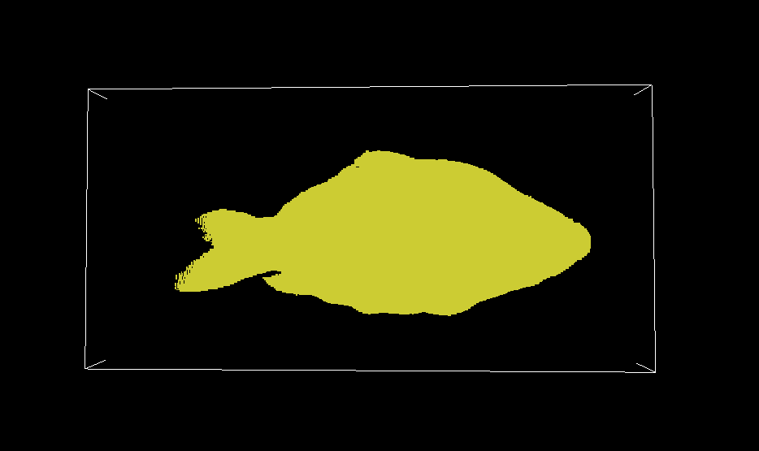
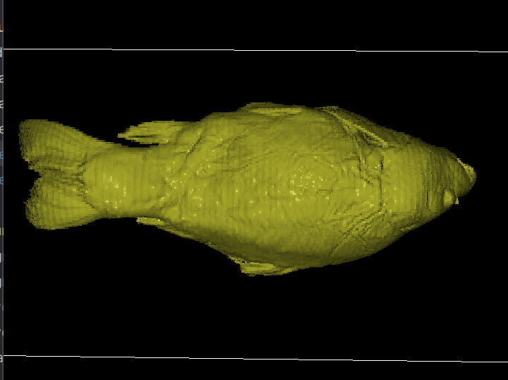
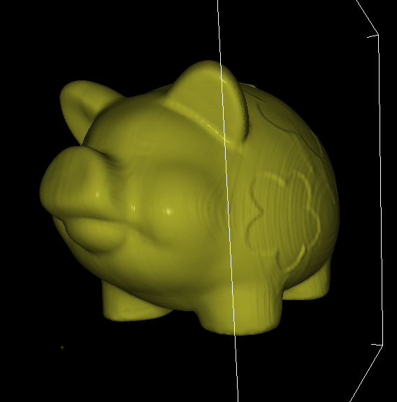
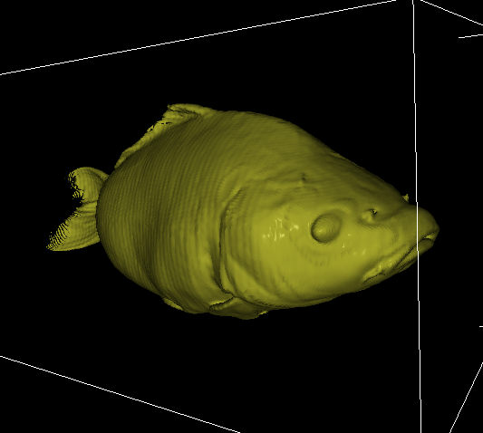
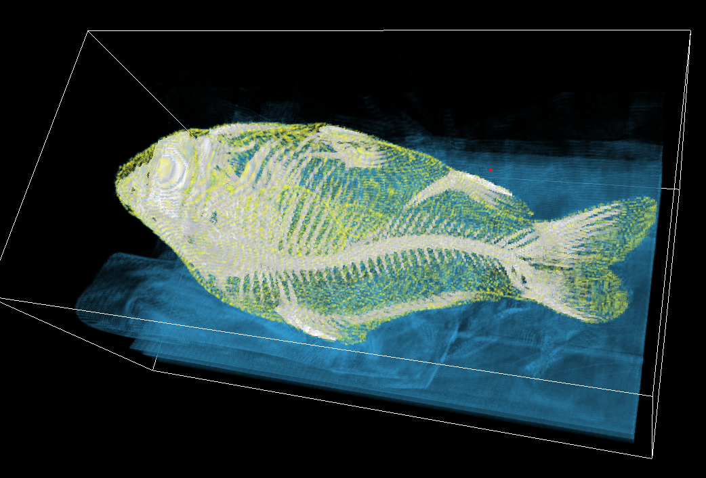
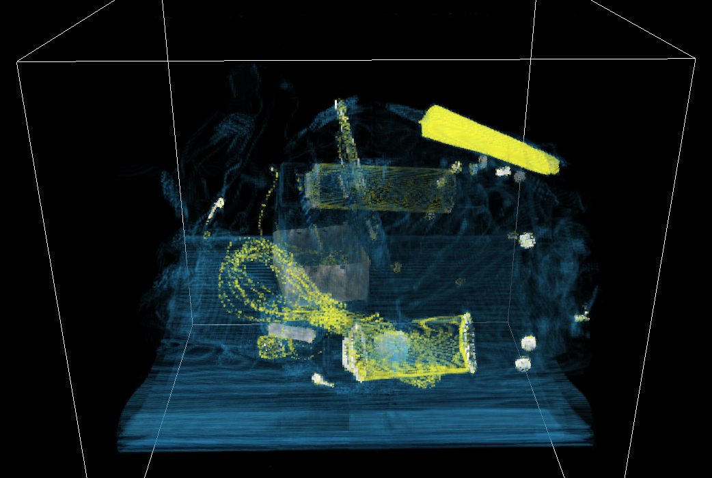

## 3DV Assignment 1

Group 12

#### Iso-surface Raycasting
Isosurface raycasting is a threshold-based rendering technique where parts of the image with values below a specified threshold are "peeled away" or discarded, while contours above the threshold are preserved. It is achieved by continuously sampling along a ray: if a voxel’s strength exceeds the threshold, a designated target color is displayed; otherwise, the corresponding pixel is black.

A binary search approach can be employed to achieve higher precision in isosurface raycasting. This method assumes that the strength values along each sampled segment of the ray increase monotonically and search for a position that is most similar with the threshold.

  
  

basic Iso-surface Raycasting(left), Iso-surface Raycasting with binary search and Phong shading(right)

### Phong Shading
The phong shading implements the standard phong model of combining ambient, diffusion and specular terms in order to create the shading. However since there are no surfaces in direct volume rendering which would otherwise be needed for the normals used in calculations, we instead rely on the intensity gradient between materials.	
Trilinear interpolation of the gradients is also implemented to allow for smoother images by enabling linear interpolation, rather than nearest neighbour.

The images of the pig and carp show two distinct angles from which the different aspects of the shading can be seen (both shadows and highlights).

  
  

Phong shading with linear interpolation of the pig (left) and carp (right) volumes.

### 1D Transfer Function 
Compositing raycasting was implemented in traceRayComposite, allowing visualization of internal structures using a 1D transfer function. The ray traverses the volume, accumulating colour and opacity values to create a smooth rendering of materials. The implementation follows a front-to-back compositing approach with early termination for efficiency.

#### Example Screenshots

Screenshot 1: Shows compositing on the Carp8 dataset, revealing internal structures. The image demonstrates how the transfer function allows differentiating between multiple material types within the volume. The smooth gradient transitions in opacity help visualize the depth and internal structure of the dataset.

Screenshot 2: Displays a scanned backpack with various contents, including a distinct elongated tube that is clearly highlighted in yellow. The transfer function effectively isolates different materials, making the tube stand out from the surrounding objects. The ability to adjust the transfer function allows for selective enhancement of specific features, demonstrating the flexibility of the compositing method for diverse datasets.

  
  

